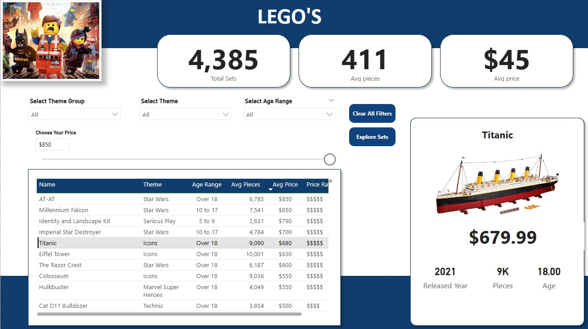
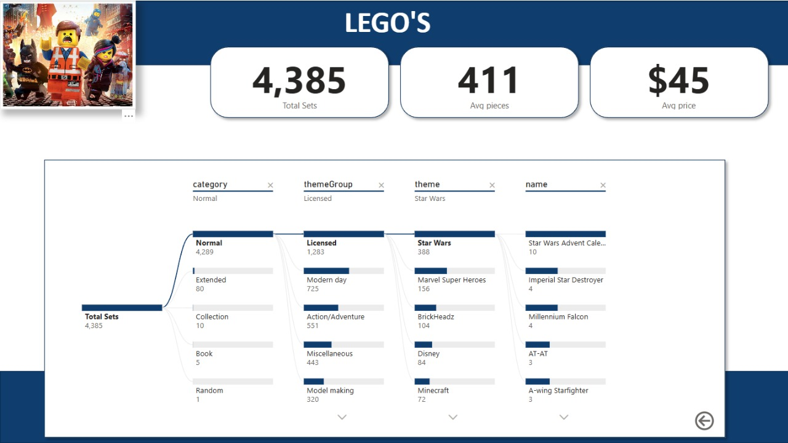

# 🧱 Lego Sales Analysis Dashboard

## 📊 Project Overview
This Power BI dashboard enables **data-driven decision-making** by providing a comprehensive and interactive analysis of LEGO sets. It allows users to explore and evaluate key metrics such as:
- 🗓️ **Release Year** – Understand the timeline of product launches.  
- 🧩 **Piece Count** – Evaluate the complexity and build time of each set.  
- 💰 **Price** – Compare sets within a specific budget.  
- 👶 **Recommended Age Range** – Filter sets based on age suitability.

## 🧠 Key Features
- **Interactive Filtering** – Use slicers to narrow down your search based on price, year, or age group.
- **Dynamic Data Table** – View real-time updates as you apply filters to assist in **informed decision-making**.
- **Hover Tooltips with Images** – Hover over set names to preview visuals for quick identification.
- **Clear Filters Button** – Instantly reset all selections and start fresh.
- **Explore Sets Navigation** – Use the **“Explore Sets”** button to navigate to the **Decomposition Tree** view.
## 🔍 Decomposition Tree Analysis
Dive deeper into the data using the **Decomposition Tree**, a powerful visual tool for:
- **Root Cause Analysis**
- **Breakdown by Hierarchical Metrics**
- **Exploring Trends and Drivers of Key Variables**

## 🎯 Purpose

This dashboard is built to assist users—especially collectors, parents, and LEGO enthusiasts—in making **insightful purchasing decisions**. It also showcases how Power BI can be used for **analytical storytelling**, **data visualization**, and **decision support**.

---

## 📊 Dashboard Overview

The Power BI report includes multiple pages designed to offer interactive analysis and decision-support tools for LEGO sets. Key dashboard elements include:

- **Category & Subcategory Breakdown**: Analyze LEGO sets by themes, product lines, and categories to explore product diversity.
- **Set Details Table**: View each set's release year, piece count, price, and recommended age range with dynamic filtering.
- **Decomposition Tree**: Drill down into metrics for deeper analysis and understand key factors influencing set characteristics.
- **Image Tooltips**: Hover over set names to view visual previews for better identification.
- **Interactive Filters**: Filter LEGO sets by price range, age suitability, or other dimensions to support data-driven decision-making.
- **Reset Button**: Quickly clear all filters and start a fresh analysis.

This dashboard is built to help users—whether collectors, parents, or enthusiasts—explore LEGO sets effectively and make insightful purchasing or comparison decisions.

---

## 🎯 Key Business Questions Answered

This Power BI dashboard helps answer critical business and consumer-focused questions such as:

- 🧩 **What LEGO sets are available based on piece count, price, and recommended age?**
- 📅 **Which year were specific LEGO sets released?**
- 💰 **Which LEGO sets fall within a specific budget range?**
- 👦 **What is the best set for a particular age group?**
- 🔍 **How do different LEGO themes or categories compare in terms of available products?**
- 📌 **Which LEGO sets meet my specific criteria for purchase (e.g., high piece count at a lower price)?**
- 🧠 **What key attributes influence LEGO set design and pricing (via decomposition tree analysis)?**

These insights help users make **informed, data-driven decisions** when exploring or purchasing LEGO sets.

---

## 🛠️ Tools & Technologies

## 🛠️ Tools & Technologies

- **Power BI Desktop (.pbix)** – Main platform used for report creation and visualization
- **DAX (Data Analysis Expressions)** – Used for calculated columns and measures
- **Visualizations Used**:
  - Slicers
  - Table visuals
  - Bookmarks
  - Buttons
  - Images
  - Tooltip (for set preview on hover)
---
## 🔗 Contact

Created by [Nityesh Sai Panchanavarapu]
[LinkedIn](https://www.linkedin.com/in/nityesh-sai-panchanavarapu-4a8806208/) | [nityesh.work@gmail.com](mailto:nityesh.work@gmail.com)